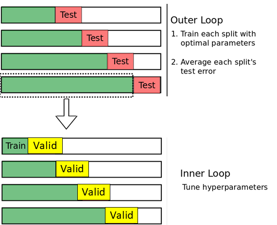
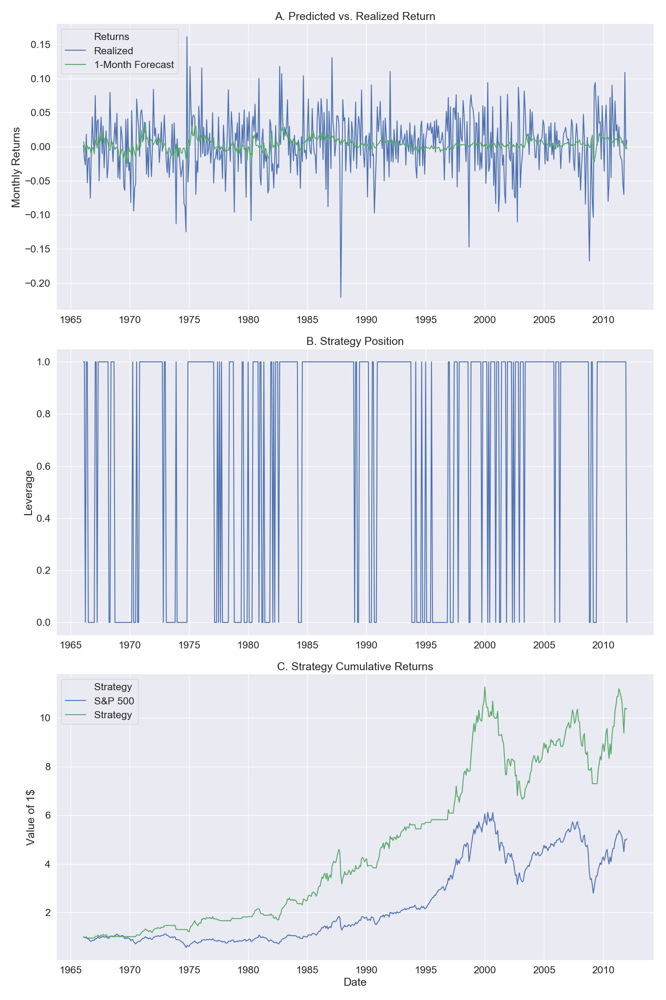

# Machine Learning and Equity Index Returns
Short Summary of the methodology and results

Author: Pavel Lesnevski \
Date: 25.06.2019
## Motivation
- Predicting monthly S&P 500 index returns using historical macroeconomic data and technical indicators. S&P 500 represents well the US equity market.
- An important task from both academic and practical perspectives
- A task with a high noise-to-signal ratio
  - Very few models are able to outperform the simple historical mean return
- High-dimensional setting with lack of data (number of predictors is comparable to the number of observations)

## Models 
I use models that perform well in the setting with many predictors and lack of observations:
  -  Ordinary least squares (OLS) with prior dimensionality reduction (see [Neely et al. (2014)](https://papers.ssrn.com/sol3/papers.cfm?abstract_id=1787554)).
  -  Linear models with L1 and L2 regularisation terms (Ridge, Lasso,  and Elastic Net). The models were introduced in Hoerl and Kennard (Technometrics, 1970), Tibshirani (Journal of the Royal Statistical Society, 1996) and
 Zou and Hastie (Journal of the Royal Statistical Society, 2005).
      - It is important to notice that the Elastic Net contains both L1 and L2 regularization terms. Thus, Lasso and Ridge can be generalized by an Elastic Net with one of the regularization terms equal to zero. I use Elastic Net and let the cross-validation method to choose the optimal hyperparameters and the respective optimal model. 
  - Bagging and Boosting tree-based methods ([Breiman (2001)](https://projecteuclid.org/download/pdf_1/euclid.ss/1009213726))

## Data
Start with the data from [Neely et al. (2014)](https://papers.ssrn.com/sol3/papers.cfm?abstract_id=1787554):

- 14 Macro Variables + 14 Technical Indicators  
- 1950 – 2011 = 732 months

From the paper:

>Macro Variables:
>1. Dividend-price ratio (log), DP: log of a twelve-month moving sum of dividends paid on the S&P 500
index minus the log of stock prices (S&P 500 index).
>2. Dividend yield (log), DY: log of a twelve-month moving sum of dividends minus the log of lagged stock
prices.
>3. Earnings-price ratio (log), EP: log of a twelve-month moving sum of earnings on the S&P 500 index
minus the log of stock prices.
>4. Dividend-payout ratio (log), DE: log of a twelve-month moving sum of dividends minus the log of a
twelve-month moving sum of earnings.
>5. Equity risk premium volatility, RVOL: based on the moving standard deviation estimator
>6. Book-to-market ratio, BM: book-to-market value ratio for the Dow Jones Industrial Average.
>7. Net equity expansion, NTIS: ratio of a twelve-month moving sum of net equity issues by NYSE-listed
stocks to the total end-of-year market capitalization of NYSE stocks.
>8. Treasury bill rate, TBL: interest rate on a three-month Treasury bill (secondary market).
>9. Long-term yield, LTY: long-term government bond yield.
>10. Long-term return, LTR: return on long-term government bonds.
>11. Term spread, TMS: long-term yield minus the Treasury bill rate.
>12. Default yield spread, DFY: difference between Moody’s BAA- and AAA-rated corporate bond yields.
>13. Default return spread, DFR: long-term corporate bond return minus the long-term government bond
return.
>14. Inflation, INFL: calculated from the Consumer Price Index (CPI) for all urban consumers; we use xi,t−1
in (1) for inflation to account for the delay in CPI releases.
 In this setting, OLS is expected to provide a poor/noisy estimate
Choose methods that perform well in high-dimensional 

>To compare technical indicators with the macroeconomic variables, we employ 14 technical indicators based
on three popular technical strategies. The first is a moving-average (MA) rule. The second technical strategy is based on momentum. Technical analysts frequently employ volume data in conjunction with past prices to identify market trends.
In light of this, the final technical strategy that we consider incorporates “on-balance” volume.

See [Neely et al. (2014)](https://papers.ssrn.com/sol3/papers.cfm?abstract_id=1787554) for more details.

## Exploratory Data Analysis
In this [Jupyter notebook](../notebooks/01-PL-First-Data-Analysis.ipynb) I do exploratory data analysis and find that in a simplified setting considered models are able to outperform historical mean in predicting S&P 500 index returns. 

## Cross-Validation Method
In this project I develop and implement a novel cross-validation method - one-month forward expanding window nested cross-validation. This cross-validation method chooses the best hyperparameters by comparing the performance of underlying models in the one-month forward predictive setting. Each month those hyperparameters are chosen that ensure the best performance for the historical validation sample. The figure below explains this method. 
##### Figure: One-Month Forward Expanding Window Nested Cross-Validation Explained

In the first step of the outer loop, 180 months (1951-1965) are used as a starting sample. To make a forecast for the test month 181, the model with different hyperparameters is trained on 179 months and validated on the month 180. For that month, The predictions of the model with different hyperparameters are compared and the set of hyperparameters that results in the lowest squared error in that month is chosen. The forecast error for the test month 181 is calculated. 

In the next step of the outer loop, the training and validation window is extended by one month to 181 months. In the first iteration of the inner loop, the model with the same sets of hyperparameters is again trained on 179 months and one-month forward forecast errors for the month 180 (the first validation month) are calculated. In the next iteration of the inner loop, the model is trained on the sample of 180 months and the forecast errors for the month 181 (the second validation month) are calculated. The best set of hyperparameters to forecast returns in the test month 182 is a set that delivers the lowest mean squared error on the validation months, $MSE_{validate}$. In this step of the outer loop, the month 182 is added to the training sample and the validation sample consists of months 180 and 181. 

This procedure continues until the last period in the data. I calculate mean squared error overall test months of the whole sample period, $MSE_{test}$, for considered models. The best model delivers the lowest $MSE_{test}$. The described cross-validation procedure is a natural historical simulation of a model's performance. 

See more on cross-validation for time-series analysis for example in this Medium [article](https://towardsdatascience.com/time-series-nested-cross-validation-76adba623eb9). 

## Results
In the table below I compare performance over different models. $MSE_{validate}$ is the average validation MSE over all sample months. $MSE_{test}$ is the MSE on the test sample. $MSPE^{adj}$ is an  adjusted t-statistic from [Clark and West (2007)](https://www.sciencedirect.com/science/article/pii/S0304407606000960) for the statistical test on whether a model under consideration outperforms the simple average mean in predicting index returns. The p-values can be obtained from the respective [tables](https://www.itl.nist.gov/div898/handbook/eda/section3/eda3672.htm). $R^2_{OOS}$ is out-of-sample R-squared introduced by [Campbell and Thomson (2008)](rfs.oxfordjournals.org/cgi/doi/10.1093/rfs/hhm055). It measures the reduction in mean squared error on the test sample relative to the historical moving average. Positive $R^2_{OOS}$ means that the respective model outperforms the historical moving average. See the respective papers for more details.
##### Table: Predictive performance of different models (one-month forward expanding window nested cross-validation)
| Name              | $MSE_{test}$ | $MSPE^{adj}(test)$  | $MSE_{validate}$ | $R^2_{OOS}$ |
|-------------------|--------------|-------------------------------|------------------|------------|
| Moving Mean       | 20.22        | 0.14                          | 15.94            | 0.0000     |
| OLS               | 22.53        | 1.41                          | 14.02            | -0.1145    |
| PCA + OLS         | 20.62        | 2.24                          | 18.15            | -0.0198    |
| **Elastic Net**       | **19.89**        | **2.91**                          | **17.61**            | **0.0163**     |
| Random Forest     | 20.74        | 1.62                          | 18.50            | -0.0257    |
| Adaptive Boosting | 22.08        | 1.10                          | 20.38            | -0.0921    |
| Gradient Boosting | 22.07        | 0.77                          | 19.66            | -0.0914    |
| XGBoost           | 23.08        | 0.79                          | 20.44            | -0.1413    |

Results reveal that Elastic Net is the only model that delivers positive $R^2_{OOS}$ and  $MSE_{test}$ below the historical moving mean.
$MSPE^{adj}(test)$ reflects a significant decrease in the mean squared forecasting error at any common significance level.

In the table below I compare the effect of different cross-validation methods on the accuracy of the Elastic Net model. 

##### Table: Comparing Cross-Validation Methods
| Name                | $MSE_{test}$ | $MSPE^{adj}(test)$   | $MSE_{validate}$ | $R^2_{OOS}$ |
|---------------------|--------------|------------------------------|------------------|-------------|
| Enet + No CV        | 20.11        | 1.28                         | 15.73            | 0.0054      |
| Enet + 5-fold CV    | 20.04        | 2.20                         | 15.38            | 0.0091      |
| Enet + 10-fold CV   | 19.97        | 2.73                         | 15.27            | 0.0121      |
| Enet + Expanding CV | 19.89        | 2.91                         | 17.61            | 0.0163      |

The results reveal that one-month forward expanding window nested cross-validation delivers the most accurate forecasts.

Is it possible to turn this more accurate forecasts in a profitable trading strategy? The figure below answers this question. In panel A, I draw one-month forward forecasts of the Elastic Net model versus realized S&P 500 index returns. As [Campbell and Thomson (2008)](rfs.oxfordjournals.org/cgi/doi/10.1093/rfs/hhm055) notice, even a small improvement in forecasting accuracy might result in sizable economic effects. I use these return forecasts to construct a simple strategy. The strategy enters the S&P 500 index when the forecasted return is above 0. Otherwise, the strategy's position in the index is zero. The corresponding position dynamics is depicted in panel B of the figure. Finally, panel C shows the value of one dollar invested in 1966 in the S&P 500 index and the market timing strategy based on the Elastic Net model. The strategy results in around 2 times higher wealth by the end of the period than pure S&P 500 index. One dollar invested in the strategy turns into 10 dollars. In comparison, the S&P 500 strategy turns into around 5 dollars. 

##### Figure: Performance of Elastic Net Strategy with One-Month Ahead Expanding Window Nested Cross-Validation:

## Ideas and Possible Extensions 

- Optimize new cross-validation algorithm. Currently, it does all cross-validations independently for each period - repetitive estimations. Calculations could be accelerated by orders of magnitude by using calculations from previous periods.
- Include interaction terms and lags of predictors to improve performance of the linear models.
- Neural networks could be tested (such as LSTM). But these models usually require a larger amount of data for precise estimates.  
- Extend results to:
  - Other indexes/asset classes
  - Weekly/daily data frequency
  - More various predictors
 - Potential to contribute to the scikit-learn package by adding expanding and rolling window nested cross-validation methods
 - Show other strategy performance measures, such as maximum drawdown, Sharpe ratio and etc.

