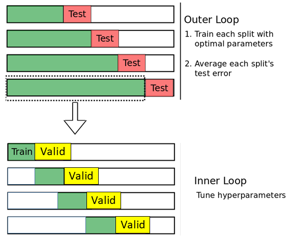
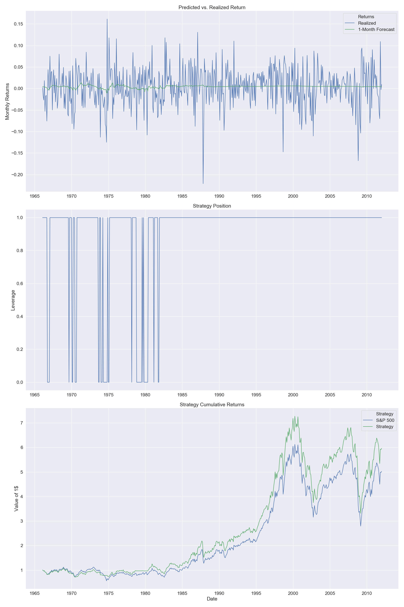
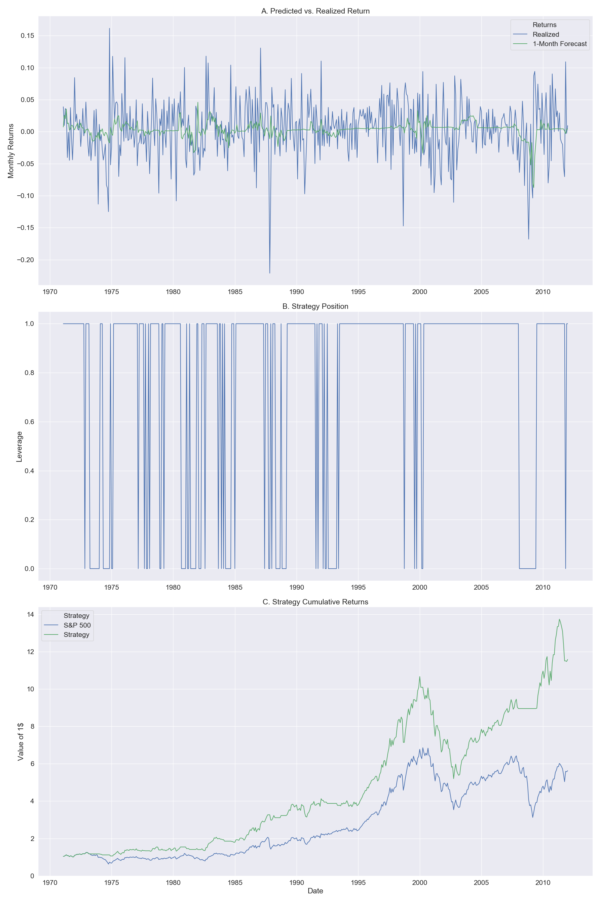

# Machine Learning and Aggregate Stock Market Returns
Author: Pavel Lesnevski \
Date: 21.06.2019
## Cross-Validation Methods

## Elastic Net Strategy Performance with Different Cross-Validation Methods
### Elastic Net Strategy - without Cross-Validation:

### Elastic Net Strategy - with Expanding Window Cross-Validation:

### Elastic Net Strategy - with Fixed Rolling Window Cross-Validation:
