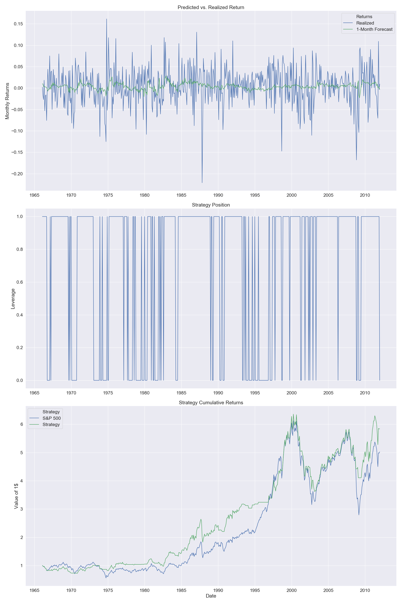

# Machine Learning and Aggregate Stock Market Returns
Author: Pavel Lesnevski \
Date: 21.06.2019
## Motivation
- Predicting monthly S&P 500 index returns using historical macroeconomic data and technical indicators
- Interesting from both academic and practical perspectives
- A task with high noise-to-signal ratio
  - Very few models are able to outperform the simple historical mean return
- High-dimensional setting with lack of data (number of predictors is comparable to the number of observations) -> Use models that perform well in this setting:
  -  Linear models with L1 and L2 regularisations (Lasso, Ridge and Elastic Net).
  - Random Forest and other tree-based methods ([Breiman, Leo, 2001, Statistical Modeling: The Two Cultures, Statistical Science 16, 199–231.](https://projecteuclid.org/download/pdf_1/euclid.ss/1009213726))
## Data
Start with data from [Neely et al. (2014)](https://papers.ssrn.com/sol3/papers.cfm?abstract_id=1787554):

- 14 Macro Variables + 14 Technical Indicators  
- 1950 – 2011 = 732 months

From the paper:

>Macro Variables:
>1. Dividend-price ratio (log), DP: log of a twelve-month moving sum of dividends paid on the S&P 500
index minus the log of stock prices (S&P 500 index).
>2. Dividend yield (log), DY: log of a twelve-month moving sum of dividends minus the log of lagged stock
prices.
>3. Earnings-price ratio (log), EP: log of a twelve-month moving sum of earnings on the S&P 500 index
minus the log of stock prices.
>4. Dividend-payout ratio (log), DE: log of a twelve-month moving sum of dividends minus the log of a
twelve-month moving sum of earnings.
>5. Equity risk premium volatility, RVOL: based on the moving standard deviation estimator

>6. Book-to-market ratio, BM: book-to-market value ratio for the Dow Jones Industrial Average.
>7. Net equity expansion, NTIS: ratio of a twelve-month moving sum of net equity issues by NYSE-listed
stocks to the total end-of-year market capitalization of NYSE stocks.
>8. Treasury bill rate, TBL: interest rate on a three-month Treasury bill (secondary market).
>9. Long-term yield, LTY: long-term government bond yield.
>10. Long-term return, LTR: return on long-term government bonds.
>11. Term spread, TMS: long-term yield minus the Treasury bill rate.
>12. Default yield spread, DFY: difference between Moody’s BAA- and AAA-rated corporate bond yields.
>13. Default return spread, DFR: long-term corporate bond return minus the long-term government bond
return.
>14. Inflation, INFL: calculated from the Consumer Price Index (CPI) for all urban consumers; we use xi,t−1
in (1) for inflation to account for the delay in CPI releases.
 In this setting, OLS is expected to provide a poor/noisy estimate
Choose methods that perform well in high-dimensional 

>To compare technical indicators with the macroeconomic variables, we employ 14 technical indicators based
on three popular technical strategies. The first is a moving-average (MA) rule. The second technical strategy is based on momentum. Technical analysts frequently employ volume data in conjunction with past prices to identify market trends.
In light of this, the final technical strategy that we consider incorporates “on-balance” volume
## Exploratory Data Analysis
In this [Jupyter notebook](../notebooks/01-First_Data_Analysis.ipynb) I do exploratory data analysis to make sure that considered models are able to improve the predictive power of .

## Cross-Validation Methods

See more on cross-validation for time-series analysis in this Medium [article](https://towardsdatascience.com/time-series-nested-cross-validation-76adba623eb9). 

## Results

## Elastic Net Strategy Performance with Different Cross-Validation Methods
### Elastic Net Strategy - with 5-Fold Cross-Validation:

### Elastic Net Strategy - with Expanding Window Cross-Validation:

### Elastic Net Strategy - with Fixed Rolling Window Cross-Validation:

##Ideas
- To improve efficiency of the new cross-validation algorithms. They could be accelerated by orders of magnitude by using calculations from pervious periods. Currently, it does all cross-validations indepndently for each period. 
uncheck  
- Neural networks could be tested (such as LSTM). These models are not used in this study yet because they usually require larger amount of data  
- Extend results to:
  - Other indexes/asset classes
  - add more various predictors
  - Weekly/daily data frequency
